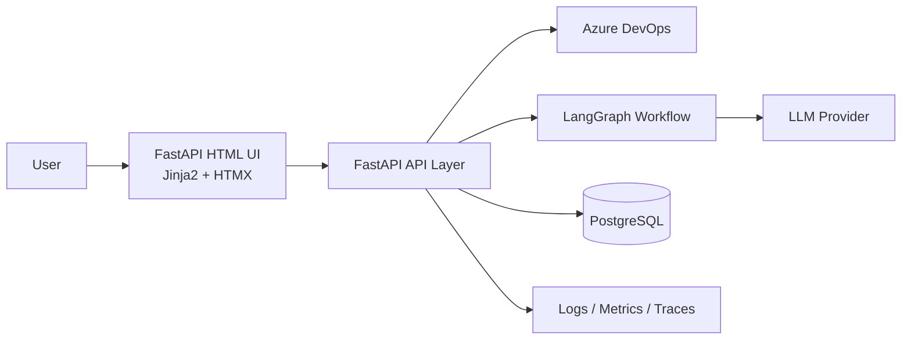
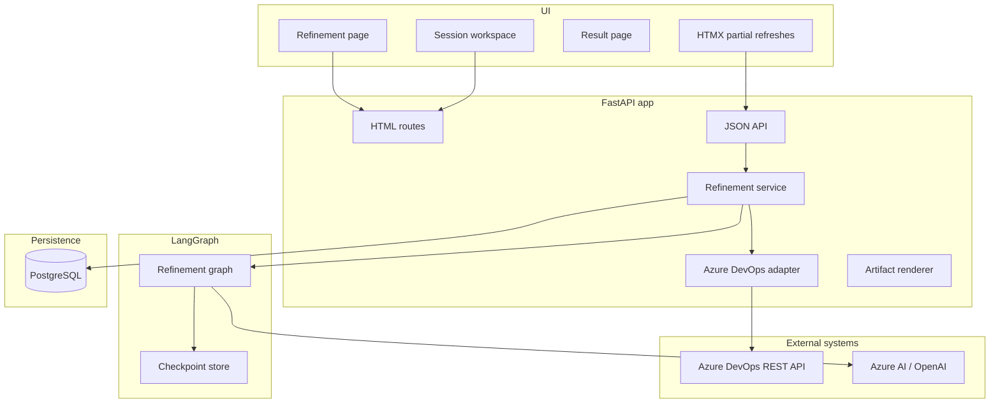
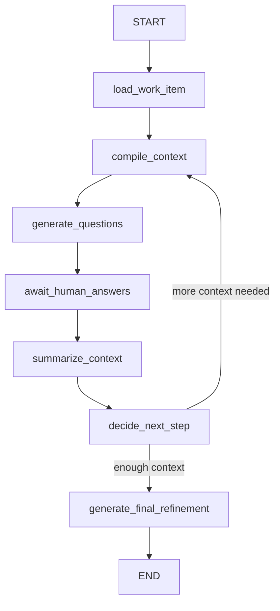

# MVP Blueprint

## 1. Product scope

The MVP covers a guided refinement workflow for existing Azure DevOps work items.

In scope:

- search and select an Azure DevOps work item
- ingest title, description, tags, acceptance criteria, links, and metadata
- accept an extra free-text context from the user
- generate iterative clarification questions
- capture team answers
- generate a structured final refinement artifact
- export the final artifact as markdown

Out of scope for MVP:

- automatic work item creation back into Azure DevOps
- repository scanning
- pipeline scanning
- semantic search across repositories
- multi-agent orchestration
- automatic prompt routing by provider cost

## 2. Why this stack fits the existing project ecosystem

After inspecting `../app`, the following patterns are already established and should
be reused instead of introducing a second full-stack model:

- `FastAPI` app entry point and lifespan management
- separation between `src/routes/` for HTML and `src/api/` for JSON
- `Jinja2Templates` with shared base templates
- `HTMX` for lightweight progressive interactions
- `LangGraph` graphs with `thread_id` and checkpointing
- `Pydantic Settings` for configuration
- `SQLAlchemy` session management and `Alembic` migrations

The refinement tool is a stateful, iterative human-in-the-loop workflow. That is a
better fit for `LangGraph` than for a plain request-response prompt wrapper.

## 3. Architecture principles

- Keep the HTML UI server-rendered for the MVP.
- Use `HTMX` for incremental updates instead of a SPA.
- Treat LangGraph as the orchestration engine, not as the main persistence layer.
- Keep PostgreSQL as the source of truth for sessions, answers, summaries, and outputs.
- Use `thread_id=session_id` so graph checkpoints and database state stay aligned.
- Validate every LLM output before it touches session state.
- Distinguish facts, assumptions, unknowns, dependencies, and risks.

## 4. System context



## 5. Container view



## 6. Target application layout

The implementation should follow the same broad shape as `../app`.

```text
src/
  main.py
  api/
    refinement.py
    schemas_refinement.py
  routes/
    refinement.py
  agents/
    refinement_workflow/
      __init__.py
      graph.py
      state.py
      nodes/
        load_work_item.py
        compile_context.py
        generate_questions.py
        summarize_context.py
        generate_final_refinement.py
        error_handler.py
  config/
    settings.py
  database.py
  models/
    refinement.py
  repositories/
    refinement_sessions_repository.py
    work_item_snapshots_repository.py
  services/
    azure_devops_refinement.py
    refinement_service.py
    artifact_renderer.py
    prompt_loader.py
  templates/
    base.html
    refinement/
      index.html
      session.html
      result.html
      partials/
        work_item_card.html
        question_round.html
        session_summary.html
        final_artifact.html
  static/
```

## 7. UI architecture

Recommended pages:

- `GET /refinement`
- `GET /refinement/sessions/{session_id}`
- `GET /refinement/sessions/{session_id}/result`

Recommended workspace layout:

- left panel: Azure DevOps work item summary
- center panel: current question round and answer form
- right panel: live session summary with facts, assumptions, unknowns, risks

Recommended HTMX usage:

- load question round partials after session creation
- submit answers asynchronously
- refresh the session summary panel without a full reload
- render the final artifact partial when the session reaches `FINAL_READY`

## 8. Routing model

Mirror the `../app` split between HTML pages and JSON endpoints.

### 8.1 HTML routes

- `GET /refinement`
- `GET /refinement/sessions/{session_id}`
- `GET /refinement/sessions/{session_id}/result`

### 8.2 JSON and HTMX endpoints

- `GET /api/refinement/work-items/search`
- `GET /api/refinement/work-items/{id}`
- `POST /api/refinement/sessions`
- `GET /api/refinement/sessions/{session_id}`
- `POST /api/refinement/sessions/{session_id}/answers`
- `GET /api/refinement/sessions/{session_id}/export`

Optional HTMX partial endpoints if needed:

- `GET /api/refinement/sessions/{session_id}/partials/current-round`
- `GET /api/refinement/sessions/{session_id}/partials/summary`
- `GET /api/refinement/sessions/{session_id}/partials/final-artifact`

## 9. LangGraph workflow

The core flow is a single graph, not multiple agents.



### 9.1 Graph node intent

- `load_work_item`: fetch and normalize Azure DevOps data
- `compile_context`: build the compact prompt input from work item, notes, and answers
- `generate_questions`: create the next best question round
- `await_human_answers`: interruption boundary managed by the web app
- `summarize_context`: extract facts, assumptions, unknowns, dependencies, risks
- `decide_next_step`: stop or loop
- `generate_final_refinement`: produce the final structured artifact

### 9.2 Human-in-the-loop strategy

Use the same pattern already present in `../app`.

- compile the graph with checkpoint support
- use `thread_id=session_id`
- interrupt before `await_human_answers`
- return control to the FastAPI route layer
- persist answers in PostgreSQL
- resume the graph with the same `thread_id`

Important:

- LangGraph checkpoints help the workflow resume cleanly
- application tables remain the durable audit trail
- the graph should never be the only place where answers or outputs exist

### 9.3 Checkpoint strategy

Recommended progression:

- local dev: in-memory or sqlite-backed checkpointer if needed
- shared environments: PostgreSQL-backed checkpointer

The graph state should be resumable after:

- browser refresh
- backend restart
- user pause between rounds

## 10. Recommended graph state

```python
class RefinementState(TypedDict):
    session_id: str
    work_item_id: str
    work_item: dict
    extra_context: str
    round: int
    max_rounds: int
    max_questions_per_round: int
    asked_questions: list[dict]
    answers: list[dict]
    facts: list[str]
    assumptions: list[str]
    unknowns: list[str]
    dependencies: list[str]
    risks: list[str]
    confidence: str
    enough_context: bool
    final_artifact: dict | None
    errors: list[dict]
```

This state stays compact on purpose. The raw transcript and raw payloads should be
stored in database tables, not expanded into every graph transition.

## 11. Azure DevOps integration

The integration should be wrapped behind a dedicated service and adapter.

Responsibilities:

- search work items
- fetch detailed work item data
- normalize organization-specific fields into an internal DTO
- preserve raw payloads for traceability

Minimum fields to normalize:

- id
- type
- title
- description
- acceptance criteria
- tags
- area path
- iteration path
- priority
- state
- relations

Engineering notes:

- descriptions are often HTML and require sanitization and plain-text extraction
- field mappings vary between Azure DevOps organizations and must remain configurable

## 12. Persistence model

Use PostgreSQL tables for:

- refinement sessions
- work item snapshots
- question rounds and questions
- answers
- session summaries
- final artifacts
- optional prompt run metadata

See `docs/sqlalchemy-data-model.md` for the target relational model.

## 13. LLM interaction model

The LLM loop should not replay a raw chat transcript on every call.

Use three layers:

1. source context
2. interaction log
3. compiled session summary

Stages:

1. `generate-questions`
2. `summarize-context`
3. `generate-final-refinement`

All outputs must be:

- strict JSON
- validated against the contract schemas in `contracts/`
- parsed by `Pydantic` models before persistence

## 14. Output contract philosophy

Structured outputs are non-negotiable for this tool.

Benefits:

- deterministic rendering in Jinja partials
- safer LangGraph loop transitions
- easier markdown export
- easier prompt regression testing

## 15. Security and access model

- keep Azure DevOps credentials server-side only
- never expose PATs or LLM credentials to the browser
- redact secrets from logs and traces
- require authentication for refinement sessions
- persist source payloads carefully because tickets may contain sensitive details

## 16. Observability

Track at minimum:

- session created
- work item fetched
- round generated
- answers submitted
- summary generated
- final artifact generated
- schema validation failure
- provider error
- latency per graph stage
- token usage per graph stage

Recommended trace attributes:

- session_id
- work_item_id
- thread_id
- prompt_version
- model
- round
- enough_context
- confidence

## 17. Evolution path to MCP and deeper context

Once the human loop works reliably, add pluggable context sources.

Recommended interfaces:

- `WorkItemProvider`
- `ContextSource`
- `RefinementEngine`
- `ArtifactRenderer`

Future context sources:

- repository context via MCP
- pipeline YAML context via MCP
- release notes context
- architecture decision records

That keeps the current MVP simple while leaving a clean expansion path toward the
long-term LangGraph and MCP vision.
