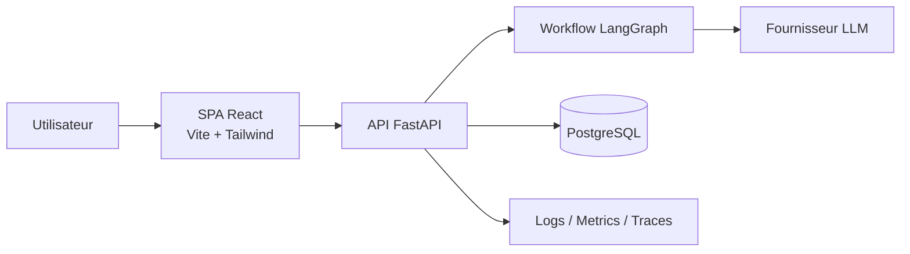
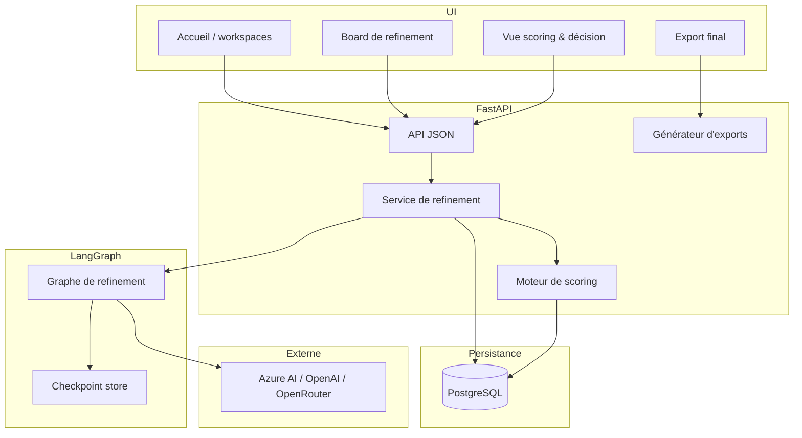
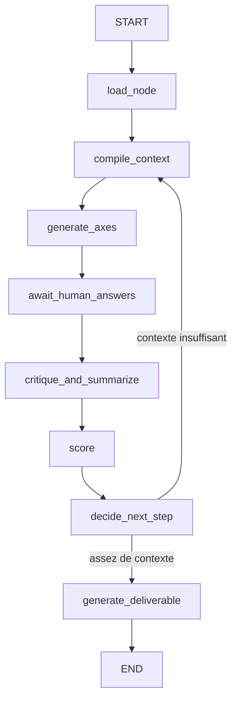

# Blueprint MVP

## 1. Scope produit

Le MVP couvre **un seul workflow, de bout en bout** : transformer un brainstorm
d'équipe en décision priorisée puis en artefact exploitable, dans une seule session.

Principe directeur pour tenir le scope : **un seul persona, un seul workflow, une seule
promesse.**

In scope :

- workspace simple (l'espace d'une équipe)
- board de refinement collaboratif (idées organisées en arborescence)
- moteur IA de structuration + critique (axes, questions, reformulations)
- scoring impact / effort / risque / confiance
- export vers brief produit ou backlog (Markdown / CSV / JSON) et note de cadrage

Out of scope pour le MVP :

- permissions avancées
- temps réel complexe type Figma / Miro natif
- intégrations profondes Jira / Linear / Azure DevOps
- analytics avancés
- billing sophistiqué

## 2. Persona & workflow unique

Persona principal : PM, Product Owner ou Tech Lead dans une équipe produit-tech de 3 à
10 personnes. Wedge initial : le founder solo qui raffine une idée SaaS.

Workflow cible : **capturer une idée → la challenger collectivement → la scorer →
l'exporter en note de cadrage ou backlog initial.**

KPI d'activation : une équipe crée un board, raffine une idée et obtient un export
final **dans la même session**.

## 3. Principes d'architecture

- La SPA React est le front ; le backend FastAPI possède l'orchestration.
- LangGraph est le **moteur d'orchestration** du refinement, pas la couche de
  persistance principale.
- PostgreSQL reste la **source de vérité** pour les boards, nœuds, itérations, scores,
  votes et exports.
- `thread_id` aligne les checkpoints du graphe avec l'entité raffinée (board / nœud).
- Toute sortie LLM est **validée avant** de toucher l'état applicatif.
- On distingue explicitement **faits, hypothèses, inconnues, dépendances et risques**.
- L'IA pose les bonnes questions et aide à converger ; elle n'écrit pas tout à la place
  de l'équipe.

## 4. Contexte système



## 5. Vue conteneurs



## 6. Rôles IA

Deux rôles complémentaires structurent le moteur de refinement :

- **Agent critique** : pose des questions de clarification, repère les zones vagues,
  les hypothèses non testées et les contradictions.
- **Agent structurant** : reformule le sujet en opportunités mieux cadrées, propose des
  axes et fait converger vers des options solides.

Optionnellement, un troisième rôle « chercheur » apporte du contexte (mode débat).

Règle produit : l'IA **aide à converger**, elle ne remplace pas la décision de
l'équipe.

## 7. Workflow LangGraph

Le cœur est un graphe unique centré sur le raffinement d'un nœud d'idée.



### 7.1 Intention des nœuds

- `load_node` : charger le nœud d'idée et son contexte (parent, historique).
- `compile_context` : construire l'entrée de prompt compacte (idée, notes, réponses).
- `generate_axes` : générer 4 à 6 axes / questions (problème, cible, valeur, risque,
  dépendances, métriques).
- `await_human_answers` : frontière d'interruption gérée par l'app web.
- `critique_and_summarize` : extraire faits, hypothèses, inconnues, dépendances,
  risques ; repérer les flous.
- `score` : évaluer impact / effort / risque / confiance.
- `decide_next_step` : boucler ou s'arrêter.
- `generate_deliverable` : produire le livrable structuré (brief / backlog / cadrage).

### 7.2 Human-in-the-loop

- compiler le graphe avec support de checkpoint
- utiliser `thread_id` aligné sur l'entité raffinée
- interrompre avant `await_human_answers`
- rendre la main à la couche route FastAPI
- persister les réponses en PostgreSQL
- reprendre le graphe avec le même `thread_id`

Important :

- les checkpoints LangGraph aident à reprendre proprement le workflow
- les tables applicatives restent la trace d'audit durable
- le graphe ne doit jamais être le seul endroit où existent réponses ou sorties

### 7.3 Checkpoints

- dev local : checkpointer en mémoire ou SQLite
- environnements partagés : checkpointer PostgreSQL

L'état doit être reprenable après rafraîchissement du navigateur, redémarrage backend,
ou pause de l'utilisateur entre deux tours.

## 8. État du graphe (esquisse)

```python
class RefinementState(TypedDict):
    board_id: str
    node_id: str
    idea: str
    parent_context: str
    extra_context: str
    round: int
    max_rounds: int
    max_questions_per_round: int
    axes: list[dict]
    asked_questions: list[dict]
    answers: list[dict]
    facts: list[str]
    assumptions: list[str]
    unknowns: list[str]
    dependencies: list[str]
    risks: list[str]
    scores: dict           # impact / effort / risque / confiance
    confidence: str
    enough_context: bool
    deliverable: dict | None
    errors: list[dict]
```

L'état reste compact volontairement. Les transcripts et payloads bruts vont dans les
tables, pas dans chaque transition du graphe.

## 9. Modèle de persistance

Voir `openwiki/domain/data-model.md` pour le modèle relationnel cible. Tables clés :
`workspaces`, `boards`, `nodes`, `node_refinements`, `scores`, `votes`, `exports`.

## 10. Modèle d'interaction LLM

La boucle LLM ne rejoue pas un transcript brut à chaque appel. Trois couches :

1. contexte source (l'idée, ses parents, les notes)
2. journal d'interaction (questions / réponses)
3. résumé compilé du nœud

Étapes :

1. `generate-axes` / `generate-questions`
2. `critique-and-summarize`
3. `generate-deliverable`

Toutes les sorties doivent être du JSON strict, validé contre les schémas de
`src/contracts/`, parsé par des modèles Pydantic avant persistance.

> Note : les schémas de `src/contracts/` reflètent encore l'API du POC de refinement de
> tickets et devront évoluer avec le code vers le domaine board.

## 11. Sécurité et accès

- garder les credentials LLM côté serveur uniquement
- ne jamais exposer les clés fournisseur au navigateur
- rédiger (redact) les secrets dans logs et traces
- exiger l'authentification pour accéder à un workspace / board
- traiter avec soin les contenus saisis (un board peut contenir des infos sensibles)

## 12. Observabilité

Tracer au minimum :

- board créé, nœud créé
- tour de refinement généré
- réponses soumises
- critique / résumé généré
- score calculé
- livrable généré
- échec de validation de schéma
- erreur fournisseur
- latence et tokens par étape du graphe

Attributs de trace recommandés : `board_id`, `node_id`, `thread_id`, `prompt_version`,
`model`, `round`, `enough_context`, `confidence`.

## 13. Backlog priorisé

| Priorité | Fonction | Pourquoi |
| :-- | :-- | :-- |
| P0 | Créer un board et une idée racine | Sans ça, aucun workflow ne commence. |
| P0 | Raffinement IA par axes | C'est le cœur différenciant du produit. |
| P0 | Scoring et décision | C'est ce qui fait converger l'équipe. |
| P0 | Export brief / backlog | C'est la preuve de valeur métier. |
| P1 | Collaboration basique | Nécessaire pour tester l'usage équipe. |
| P1 | Templates par cas d'usage | Réduit le temps au premier résultat. |
| P2 | Intégration Jira / Linear / Azure DevOps | Utile plus tard, pas au test MVP. |
| P2 | Permissions avancées et billing | Important commercialement, mais post-MVP. |

## 14. Chemin d'évolution

Une fois la boucle humaine fiable, ajouter des sources de contexte pluggables via des
interfaces stables (`ContextSource`, `RefinementEngine`, `DeliverableRenderer`) :
mémoire produit inter-sessions, templates verticaux (idée SaaS, initiative technique,
opportunité produit), puis connecteurs de delivery. Cela garde le MVP simple tout en
laissant un chemin d'expansion propre.
