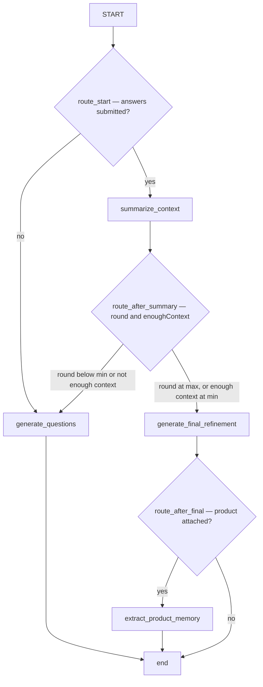

# Le moteur de raffinement — workflow LangGraph et couche LLM

La boucle de raffinement est une **machine à états LangGraph**, pas un chat libre : chaque session
parcourt le même graphe explicite, chaque étape LLM renvoie un JSON structuré validé par
Pydantic, et le graphe ne persiste jamais rien lui-même — c'est le repository qui persiste, après
validation de la sortie de chaque nœud. Le point de contrôle `thread_id` de LangGraph est aligné sur
l'identifiant de session si bien qu'une seule instance du graphe porte toute la conversation.

## Le graphe (`src/agents/refinement_workflow/graph.py`)

Quatre nœuds, tous alimentés par le même `RefinementState` (un `TypedDict`, créé par
`create_initial_state` ou reconstruit à partir de la session par
`RefinementService._build_state_from_session`) :

Graphe de raffinement : les trois branchements de routage (`route_start`, `route_after_summary`, `route_after_final`) et le nœud mémoire terminal, ignoré sans produit.

- **`generate_questions`** — appelle `llm.generate_questions` avec les axes de la grille comme
  colonne vertébrale, incrémente `round`, et stocke `latest_question_round` ainsi qu'une
  `decision` provisoire (enoughContext false, raisonnement issu du tour). Point d'entrée pour
  le démarrage de session (`workflow_action=start_session`) et pour chaque nouveau tour.
- **`summarize_context`** — synthétise facts / assumptions / unknowns / dependencies /
  risks / confidence / enoughContext à partir des questions répondues.
  Point d'entrée après `answers_submitted`.
- **`generate_final_refinement`** — assemble le livrable
  (`summary`, `brief`, `plan`, `codeDraft`, `openQuestions`, `decisionReport`) et
  met enoughContext à true.
- **`extract_product_memory`** — nœud terminal : demande au LLM uniquement le diff mémoire
  (`memory_ops`) ; la persistance appartient au service. Entièrement ignoré lorsque la
  session n'a pas de `product_id` (aucun appel LLM supplémentaire pour un diff qui serait de
  toute façon écarté).

### Règles de routage (fixées par `tests/test_routing.py`)

La fonction `route_after_summary` est volontairement conservatrice — « le LLM a tendance à
déclarer enoughContext trop tôt » :

- `min_rounds = min(state.min_rounds, state.max_rounds)` — le plancher ne dépasse jamais le plafond ;
- finaliser quand `round >= max_rounds`, ou quand `enoughContext` et
  `round >= min_rounds` ; sinon, demander un autre tour.

## Le côté service (`src/services/refinement_service.py`)

`RefinementService` gère la frontière du cycle de vie entre l'API et le graphe :

- `start_session` — résout le produit + la grille, crée la ligne de session + un instantané du
  sujet, charge les faits mémoire actifs, invoque le graphe avec
  `workflow_action=start_session`, persiste le tour obtenu et un **résumé dérivé du tour 0**
  (unknowns <- missingAreas, risks <- potentialRisks), puis renvoie le premier tour avec le
  `productMemory` injecté.
- `submit_answers` — enregistre les réponses (le repository effectue les upserts par question),
  reconstruit l'état complet à partir de la session (questions appariées aux réponses, afin que le
  LLM n'ait jamais à les joindre), invoque le graphe avec `workflow_action=answers_submitted`,
  puis persiste la sortie terminale reçue : un nouveau `latest_question_round` ou le
  `deliverable`. Lorsqu'un livrable existe **et** que la session a un produit, il applique
  `memory_ops` via `ProductMemoryRepository.apply_ops` dans la même requête, puis positionne
  `FINAL_READY`.
- `set_mode` — normalise la grille, `reset_rounds` (purge + rejeu du tour 0) avec
  réinjection de la mémoire, car le rejeu perdrait sinon les faits hérités.
- `export_markdown` — rend le livrable persisté via le moteur de rendu de
  [decision-report.md](../domain/decision-report.md).

## La couche LLM (`src/services/refinement_llm.py`)

Deux moteurs implémentent le même protocole `RefinementLLM`
(`detect_mode`, `generate_questions`, `summarize_context`,
`generate_final_refinement`, `extract_product_memory`) :

- **`MockRefinementLLM`** — moteur hors ligne déterministe : génère des questions types à partir
  des axes de la grille (tour 1) ou des `unknowns` (tours ultérieurs), ne propose que les deux
  chips utilitaires (« Je ne sais pas encore », « Sans objet pour ce sujet »), dérive la confiance
  du résumé des `unknowns`, construit le Brief en regroupant les questions répondues sous leur
  thème d'axe de grille, produit un squelette de Code Draft pour les grilles
  `technique`/`hybride`, applique les règles d'arbitrage déterministes pour le rapport de décision,
  et ne promeut en mémoire que les faits durables avec des opérations `add` uniquement.
  C'est le fournisseur par défaut (`LLM_PROVIDER=mock`) et le filet de sécurité pour toute
  défaillance d'appel réel.
- **`OpenAICompatibleLLM`** — appelle tout endpoint `/chat/completions` compatible OpenAI via
  httpx (Azure `azure-openai`/`azure-foundry` utilisent la forme
  `/openai/deployments/{deployment}/chat/completions?api-version=2024-06-01` et l'en-tête
  `api-key` ; OpenAI/OpenRouter/DeepSeek utilisent l'authentification Bearer). Il demande
  « un unique objet JSON strict », puis :
  1. parse avec `_extract_json` (supprime les délimiteurs de code, extrait entre les accolades
     les plus externes, applique `_repair_json_text` pour les virgules finales, les guillemets
     simples et les virgules manquantes entre chaînes) ;
  2. en cas d'échec du décodage JSON, réessaie **une fois** en demandant au modèle de réémettre
     exactement le même contenu en JSON valide ;
  3. en cas de tout autre échec (réseau, JSON invalide, non-conformité au schéma), bascule en mode
     dégradé vers `MockRefinementLLM` et positionne `self.degraded = True` afin que l'API renvoie
     `degraded: true` et que l'interface utilisateur affiche la bannière de repli.
  Particularités des fournisseurs : DeepSeek reçoit `reasoning_effort: "low"` car les jetons de
  réflexion sont déduits de `max_tokens` et peuvent épuiser le budget ; le raffinement final
  dispose d'un budget `max(settings.llm_max_tokens, 8000)` pour éviter de tronquer la sortie la
  plus volumineuse.

## Prompts (`prompts/`)

Six prompts Markdown sont chargés par `PromptLoader` (`prompts_dir` depuis les paramètres,
version = sha1 sur l'ensemble des fichiers de prompts, stockée sur la session sous
`prompt_version`) :

| Prompt | Nœud | Schéma de sortie |
|---|---|---|
| `system-refinement.md` | prompt système pour chaque appel | règles : aucun contexte inventé, adaptation à la grille, product_memory traité comme contexte acquis, JSON uniquement, listes ordonnées par impact décisionnel |
| `detect-mode.md` | détection de la grille (mode auto) | `DetectModeOutput` |
| `generate-questions.md` | generate_questions | `GenerateQuestionsOutput` |
| `summarize-context.md` | summarize_context | `SessionSummaryOutput` |
| `generate-final-refinement.md` | generate_final_refinement | `RefinementDeliverableOutput` |
| `extract-product-memory.md` | extract_product_memory | `ProductMemoryOpsOutput` — la règle de durabilité, diff plutôt que dump, liste exacte des catégories |

Modifier un prompt modifie `prompt_version`, enregistrée par session — incrémentez-la
délibérément et vérifiez que le JSON Schema dans `contracts/` correspond à la nouvelle forme de
sortie.

## Directives de modification

- **Quand consulter cette page :** lorsque vous touchez à la topologie/au routage du graphe, à la
  structure de l'état, aux appels LLM, aux fichiers de prompts ou à l'orchestration du service.
- **Invariants à préserver :** thread_id = identifiant de session ; les nœuds ne persistent jamais ;
  le plafonnement de `min_rounds` ; repli dégradé au lieu d'une erreur 500 ; propagation du drapeau
  `degraded` dans les deux schémas de réponse ; extraction mémoire ignorée sans produit ; les
  réponses sont upsertées, pas ajoutées.
- **Point d'extension — une nouvelle étape de graphe :** ajoutez le constructeur de nœud dans
  `nodes.py`, le nœud dans `create_refinement_graph`, la fonction de routage et les arêtes
  conditionnelles, les champs d'état dans `RefinementState`, la branche de persistance dans
  `RefinementService.submit_answers` (et éventuellement `_run_initial_round`), la méthode LLM dans
  le protocole et les deux moteurs, le fichier de prompt, et le JSON Schema dans `contracts/`.
  Étendez `tests/test_routing.py` pour la nouvelle branche.
- **Point d'extension — un nouveau fournisseur LLM :** consultez
  [llm-configuration.md](../operations/llm-configuration.md) pour la surface complète
  (paramètres d'environnement, replis de configuration à l'exécution, URL/en-têtes, test du champ
  requis, UI).
- **Tests ciblés :** `tests/test_routing.py` (matrice de routage), `tests/test_mock_decision.py` (règles de verdict) et `tests/test_product_memory_flow.py` (boucle complète `RefinementService` : démarrage, tours jusqu'au livrable, extraction mémoire, session suivante) ; le comportement questions/résumé du mock est exercé indirectement à travers ces tests — un fichier de test dédié au moteur mock est un ajout naturel lorsque le moteur change.
- **Validation :** `python -m pytest tests/test_routing.py tests/test_mock_decision.py tests/test_product_memory_flow.py -q` ;
  test de fumée du flux hors ligne complet : `uvicorn src.main:app --reload --port 8000` puis
  `POST /api/refinement/sessions` avec `{"objective": "..."}` (fournisseur mock).