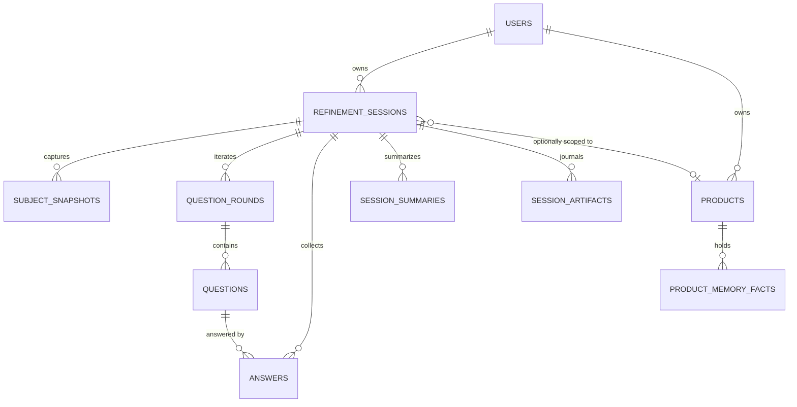
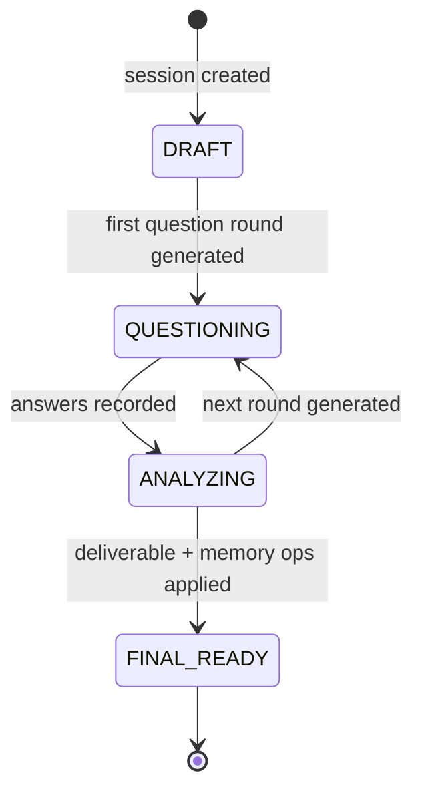

# Modèle de données et cycle de vie des sessions

PostgreSQL est la source de vérité en production (SQLite en local) ; les checkpoints LangGraph ne sont jamais le seul dépôt des réponses ou des sorties. Le modèle est aujourd’hui centré sur la session — le domaine decision-board (workspace / board / node / score / export), décrit comme cible dans `docs/implementation-plan.md` (semaine 2) et `docs/mvp-blueprint.md`, reste l’objectif visé, pas encore implémenté (le README le suit sous « Prochains incréments techniques » et renvoie à cette page comme référence du modèle cible).

## Entités (`src/models/refinement.py`)

| Table | Objectif | Champs clés |
|---|---|---|
| `users` | Utilisateur local unique aujourd’hui (authentification non construite) | `email` unique, `display_name` |
| `refinement_sessions` | Une exécution de raffinement | `user_id`, `product_id` (nullable), `subject_id`, `mode`, `grid`, `detected_grid`, `status`, `round`, `max_rounds`, `max_questions_per_round`, `extra_context`, `prompt_version`, `llm_provider`, `llm_model`, `completed_at` |
| `subject_snapshots` | Le sujet tel qu’il a été saisi à la création (et après les changements de grille) | `source`, `normalized_payload` JSON, `raw_payload` JSON |
| `question_rounds` | Un tour de questions | `round_number`, `status` (OPEN/ANSWERED), `reasoning_summary`, `missing_areas`, `potential_risks` |
| `questions` | Une question d’un tour | `external_id`, `theme`, `priority`, `question_text`, `why_text`, `suggestions` JSON (nullable pour les lignes créées avant l’existence de la colonne) |
| `answers` | Réponse à une question | `answer_text` |
| `session_summaries` | Un résumé par tour | `facts`, `assumptions`, `unknowns`, `dependencies`, `risks`, `confidence`, `enough_context`, `reason` |
| `session_artifacts` | Journal versionné de tout ce qui est produit | `type` (`SUBJECT_SNAPSHOT`, `QUESTION_ROUND`, `SESSION_SUMMARY`, `FINAL_REFINEMENT`), `version`, `payload` JSON |
| `products` | Périmètre de la mémoire produit | `name` (recherche insensible à la casse), `user_id` |
| `product_memory_facts` | Un fait durable | `category`, `statement`, `status`, `confirmed`, `source_session_id`, `uses` |
| `app_settings` | Configuration d’exécution clé/valeur (fournisseur LLM) | `key` PK, `value`, `is_encrypted`, `category`, index sur `category` et `updated_at` |

Tous les identifiants sont des chaînes UUID (`uuid4().hex`). Chaque relation de `RefinementSession` déclare `cascade="all, delete-orphan"`, donc la suppression d’une session supprime ensemble les tours, questions, réponses, instantanés, résumés et artefacts (`delete_session`).

## Cycle de vie d’une session

Les transitions sont pilotées par `RefinementRepository` :

- `create_session` -> `DRAFT` ; `add_question_round` -> `QUESTIONING` (et définit `session.round`) ;
- `record_answers` -> le tour ouvert passe à `ANSWERED` et la session à `ANALYZING` ; cette méthode effectue aussi un **upsert** des réponses par question, afin que la re-soumission d’un tour modifie les réponses au lieu de les dupliquer ;
- `add_final_artifact` -> `FINAL_READY` et renseigne `completed_at` ;
- `reset_rounds` (changement de grille via `set_mode`) purge les réponses, les tours et les résumés, réinitialise `round=0`, `status=DRAFT`, `completed_at=None`, puis rejoue le tour 0 sur la nouvelle grille.

## Journal des artefacts

`add_artifact` versionne chaque payload produit pour chaque `(session_id, type)` et l’ajoute à `session_artifacts` — l’historique immuable d’une session. C’est le payload de l’artefact `FINAL_REFINEMENT` que `GET /api/refinement/sessions/{id}` valide en un `RefinementDeliverable` (avec la migration v1 du rapport de décision, voir [decision-report.md](decision-report.md)).

## Initialisation du schéma et migration incrémentale

`src/database.py` :

- la fabrique d’engine/session est créée à partir de `settings.database_url` (pour SQLite, `check_same_thread: False` ; `echo` est contrôlé par `database_echo`) ;
- `init_db()` exécute `Base.metadata.create_all`, puis `_add_missing_columns()`, puis initialise l’utilisateur local par défaut (`settings.default_user_email` / `settings.default_user_name`).

`_add_missing_columns()` applique manuellement les colonnes ajoutées aux tables préexistantes : `questions.suggestions` (JSON), `refinement_sessions.product_id` (VARCHAR), `subject_id` (VARCHAR(128)), `subject_title` (VARCHAR(512)), `mode` (VARCHAR(32), défaut `auto`), `grid` (VARCHAR(32), défaut `po`), `detected_grid` (VARCHAR(32)). Elle réalise aussi un **backfill** des bases héritées du schéma « work item » : `subject_id` est alimenté depuis `work_item_id`, `subject_title` depuis `work_item_title`, puis `subject_id` passe en NOT NULL avec un index (`ix_refinement_sessions_subject_id`).

- **Il n’y a pas encore de configuration Alembic** (`alembic` figure dans `requirements.txt`, aucun `alembic.ini` dans le dépôt) ; l’évolution du schéma se fait via `create_all` + la migration écrite à la main. C’est une limitation connue, documentée dans [operations/deployment.md](../operations/deployment.md) et suivie dans le backlog du quickstart.

## Recommandations de modification

- **Quand consulter cette page :** lors de l’ajout ou de la modification d’une table/colonne, lors d’un changement de la sémantique des statuts de session, ou lorsqu’il faut toucher aux requêtes du repository.
- **Invariants à préserver :** le comportement de suppression en cascade ; le journal des artefacts pour toute nouvelle sortie LLM ; la séquence des statuts de session ; la convention des nouvelles colonnes nullables (les nouvelles colonnes sur des tables existantes doivent être nullables pour que la migration écrite à la main reste sûre) ; `ilike` pour une recherche portable (`list_sessions` est compilé en `lower() LIKE lower()` sur SQLite).
- **Extension de la persistance :** ajouter le modèle, l’enregistrer dans `src/models/__init__.py`, ajouter les méthodes du repository dans `src/repositories/`, puis ajouter la colonne à `_add_missing_columns` dans `src/database.py` si la table peut déjà exister dans les bases déployées. Ne pas modifier manuellement une base déployée.
- **Tests ciblés :** les fixtures `tests/conftest.py` (`db`, `client`, `offline_llm`) rendent la couche testable hors ligne ; `tests/test_product_memory_flow.py` exerce la boucle de vie complète via `RefinementService` (création, tours, livrable, mémoire) et `tests/test_product_memory.py` verrouille `apply_ops` et le plafond. Les transitions de session hors mémoire (soumission deux fois, réinitialisation de grille, suppression en cascade) restent des candidats naturels pour de futurs tests.
- **Validation :** `python -m pytest tests/ -q` (suites de tests hors ligne), plus un test de fumée manuel `uvicorn src.main:app --reload --port 8000` pour confirmer que `init_db` réussit sur une base de données vierge.