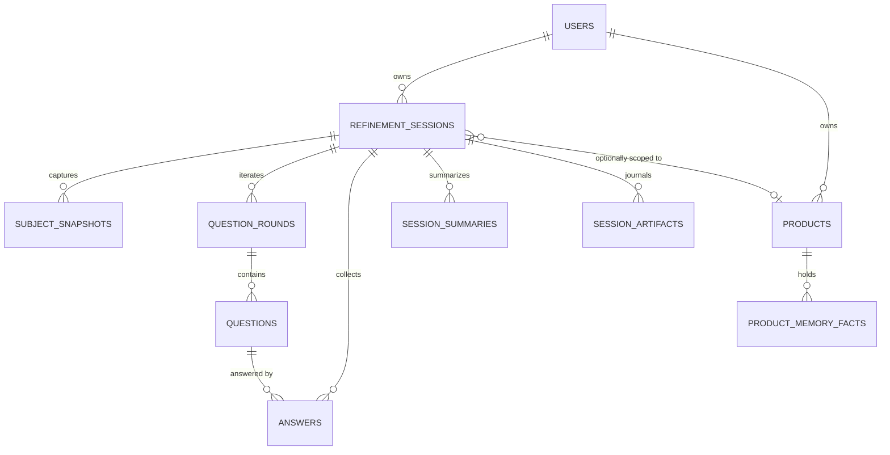
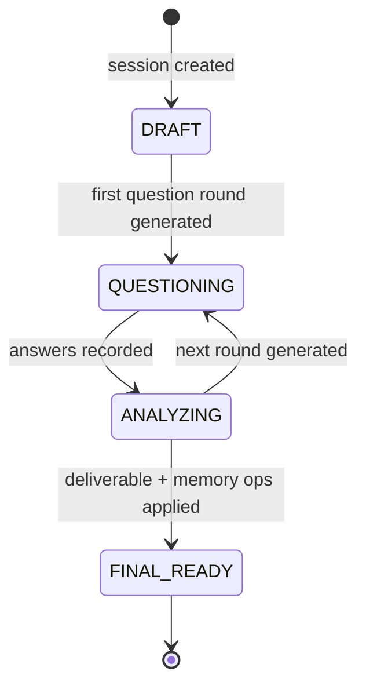

# Data Model and Session Lifecycle

PostgreSQL is the source of truth in production (SQLite locally); LangGraph
checkpoints are never the only home of answers or outputs. The model is
session-centric today — the decision-board domain (workspace / board / node / score /
export) from `docs/sqlalchemy-data-model.md` is the target, not yet implemented.

## Entities (`src/models/refinement.py`)

| Table | Purpose | Key fields |
|---|---|---|
| `users` | Single local user today (auth not built) | `email` unique, `display_name` |
| `refinement_sessions` | One refinement run | `user_id`, `product_id` (nullable), `subject_id`, `mode`, `grid`, `detected_grid`, `status`, `round`, `max_rounds`, `max_questions_per_round`, `extra_context`, `prompt_version`, `llm_provider`, `llm_model`, `completed_at` |
| `subject_snapshots` | The subject as entered at creation (and after grid changes) | `source`, `normalized_payload` JSON, `raw_payload` JSON |
| `question_rounds` | One round of questions | `round_number`, `status` (OPEN/ANSWERED), `reasoning_summary`, `missing_areas`, `potential_risks` |
| `questions` | One question of a round | `external_id`, `theme`, `priority`, `question_text`, `why_text`, `suggestions` JSON (nullable for rows created before the column existed) |
| `answers` | Answer to a question | `answer_text` |
| `session_summaries` | One summary per round | `facts`, `assumptions`, `unknowns`, `dependencies`, `risks`, `confidence`, `enough_context`, `reason` |
| `session_artifacts` | Versioned journal of everything produced | `type` (`SUBJECT_SNAPSHOT`, `QUESTION_ROUND`, `SESSION_SUMMARY`, `FINAL_REFINEMENT`), `version`, `payload` JSON |
| `products` | Product memory scope | `name` (case-insensitive lookup), `user_id` |
| `product_memory_facts` | One durable fact | `category`, `statement`, `status`, `confirmed`, `source_session_id`, `uses` |
| `app_settings` | Key/value runtime config (LLM provider) | `key` PK, `value`, `is_encrypted`, `category`, indexes on `category` and `updated_at` |

All ids are UUID strings (`uuid4().hex`). Every `RefinementSession` relationship
declares `cascade="all, delete-orphan"`, so deleting a session removes rounds,
questions, answers, snapshots, summaries and artifacts together
(`delete_session`).

## Session lifecycle

The transitions are driven by `RefinementRepository`:

- `create_session` -> `DRAFT`; `add_question_round` -> `QUESTIONING` (and sets
  `session.round`);
- `record_answers` -> the open round becomes `ANSWERED`, the session `ANALYZING`;
  it also **upserts** answers per question so re-submitting a round edits, not
  duplicates;
- `add_final_artifact` -> `FINAL_READY` and stamps `completed_at`;
- `reset_rounds` (grid change via `set_mode`) purges answers, rounds and summaries,
  resets `round=0`, `status=DRAFT`, `completed_at=None`, then replays round 0 on the
  new grid.

## Artifact journal

`add_artifact` versions every produced payload per `(session_id, type)` and appends
to `session_artifacts` — the immutable history of a session. The `FINAL_REFINEMENT`
artifact's payload is what `GET /api/refinement/sessions/{id}` validates into a
`RefinementDeliverable` (with the v1 decision-report migration, see
[decision-report.md](decision-report.md)).

## Schema bootstrap and forward migration

`src/database.py`:

- engine/session factory created from `settings.database_url` (SQLite gets
  `check_same_thread: False`; `echo` controlled by `database_echo`);
- `init_db()` runs `Base.metadata.create_all`, then `_add_missing_columns()`, which
  hand-applies columns added to pre-existing tables (currently
  `questions.suggestions` JSON and `refinement_sessions.product_id` VARCHAR), then
  seeds the default local user (`settings.default_user_email`).
- **There is no Alembic setup yet** (`alembic` is in `requirements.txt`, no
  `alembic.ini` in the repo); schema evolution is `create_all` + the hand-rolled
  migration. This is a known limitation documented in
  [operations/deployment.md](../operations/deployment.md) and tracked in the
  quickstart backlog.

## Change guidance

- **When to consult this page:** adding or changing a table/column, changing session
  status semantics, or touching repository queries.
- **Invariants to preserve:** cascade delete behavior; the artifact journal for any
  new LLM output; the session status sequence; nullable-new-column convention (new
  columns on existing tables should be nullable so the hand-rolled migration stays
  safe); `ilike` for portable search (`list_sessions` compiles to `lower() LIKE
  lower()` on SQLite).
- **Extending persistence:** add the model, register it in `src/models/__init__.py`,
  add repository methods in `src/repositories/`, then add the column to
  `_add_missing_columns` in `src/database.py` if the table may already exist in
  deployed databases. Do not hand-edit a deployed database.
- **Focused tests:** none exist for the model layer; the most valuable additions
  are lifecycle transition tests (submit answers twice, grid reset, delete cascade)
  using a temporary SQLite database.
- **Validation:** `python -m pytest tests/ -q` (offline suites), plus a manual
  smoke run `uvicorn src.main:app --reload --port 8000` to confirm `init_db`
  succeeds on a fresh database.
